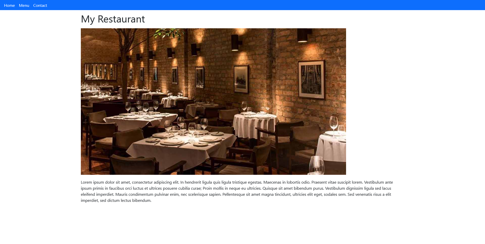

# Restaurant Page

> Small page for a restaurant dinamically rendered with JS.

The page is dinamically rendered and the content switches from a Home Page, a Menu Page, and a Contact Page.

## Built With

- Major languages: HTML, CSS, and Javascript
- Frameworks: Bootstrap
- Technologies: Webpacker

## Live Demo

[Live Demo Link](https://jpdf00.github.io/restaurant-page/)

## Getting Started*

To get a local copy up and running follow these simple example steps.

### Setup

 - On the top of this repo click on the button named "Clone"
 - Copy the HTTP URL or SSH.
 - On the terminal type `git clone <copied-value>` where is the value you copied on the previous step.

 or

 - On the top of this repo click on the button named "Clone"
 - Click on the button "Download zip".

### Usage

- Open the `index.html` file inside the `dist` folder using your browser of choice.

## Authors

👤 **João Paulo Dias França**

- GitHub: [@jpdf00](https://github.com/jpdf00)
- Twitter: [@jpdf00](https://twitter.com/jpdf00)
- LinkedIn: [João Paulo Dias França](https://www.linkedin.com/in/jpdf00/)

## 🤝 Contributing

Contributions, issues, and feature requests are welcome!

Feel free to check the [issues page](https://github.com/jpdf00/restaurant-page/issues).

## Show your support

Give a ⭐️ if you like this project!

## 📝 License

This project is [MIT](./LICENSE) licensed.
